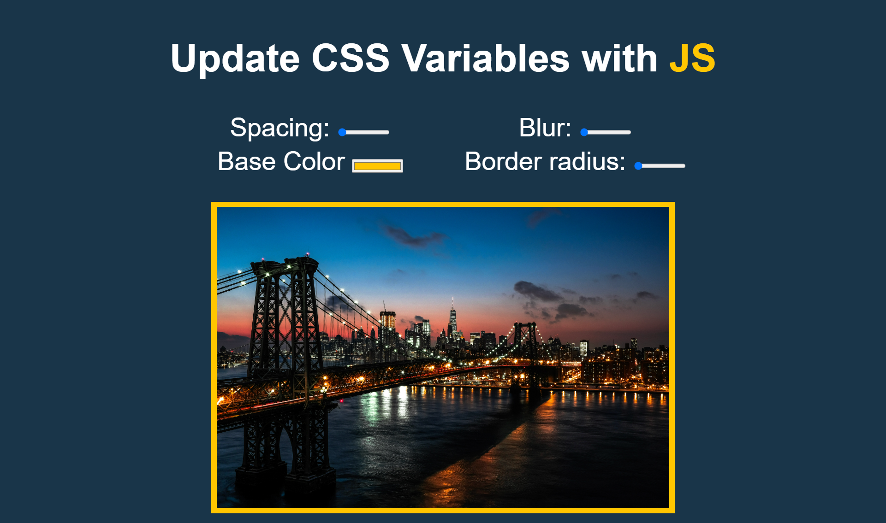
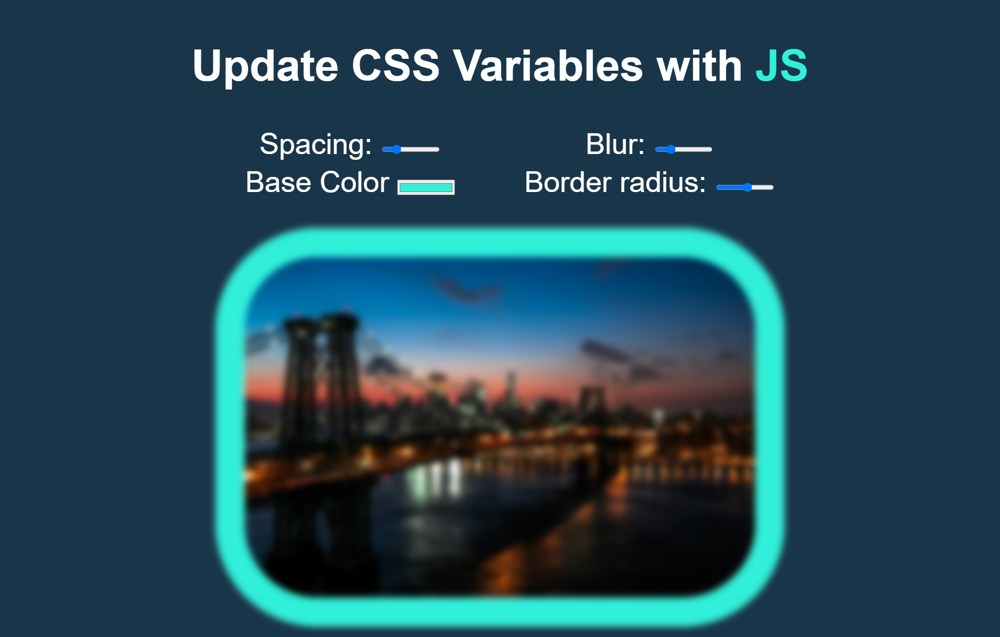

# 03---CSS-Variables

This is day two of #JavaScript30 challenge

Created this awesome website update CSS Variables with JS using HTML, CSS, and JS.

## before updating CSS variables

## after updating CSS variables

[Live Demo]()

In this project learned about : 

- dataset in JS
- update CSS Variables with JS
- events like "mousemove" and "change"
